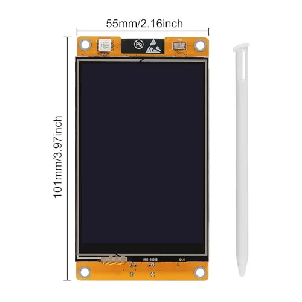
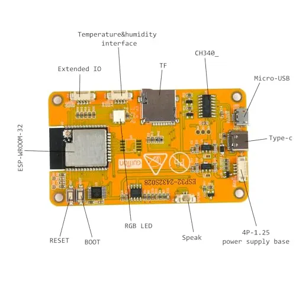

<p align='center'></p>

<h1 align='center'>cyd-wifi-sniffer</h1>

<p align='center'>WiFi packet sniffer and network traffic classifier for the ESP32-3248S035 (CYD) board.
Captures 802.11 frames in promiscuous mode, extracts features, classifies and displays live traffic on the built-in touchscreen, and logs data to microSD.</p>

---

## Table of Contents
- [Prerequisites](#prerequisites)
- [Installation](#installation)
- [Usage](#usage)
- [Data](#data)
- [ML Model Training](#ml-model-training)

---

## Prerequisites

### Software
- Python>=3.12
- PlatformIO (e.g., `brew install platformio`)

### Hardware
<p align='left'></p>

- **Board:** ESP32-3248S035 ("Cheap Yellow Display")
- **Display:** 3.5" ST7796 TFT, 480x320
- **Touch:** XPT2046 resistive touchscreen
- **Storage:** microSD card slot
- **USB:** USB-C with CH340 serial chip

---

## Installation

### Clone Repository

```bash
git clone https://github.com/kariemoorman/cyd-wifi-sniffer.git
```

### Build Firmware

```bash
cd cyd-wifi-sniffer
pio run -e cyd-sniffer
```

First build takes a few minutes (downloads the ESP32 toolchain), confirming no issues.


### Build & Flash Firmware

Verify the CYD is detected - plug in the CYD via USB-C, then run:

```bash
ls /dev/cu.*
```

You should see output similar to the following:

```
/dev/cu.Bluetooth-Incoming-Port
/dev/cu.usbserial-XXXXX
```

<details><summary><b>Troubleshooting</b></summary>
   
The `/dev/cu.usbserial-XXXXX` entry is your CYD. If it doesn't appear:

- Try a different USB-C cable (some are charge-only, no data)
- Try a different USB port
- Confirm any driver is installed if needed (e.g., `wch-ch34x-usb-serial-driver`)
- Check `System Settings > Privacy & Security` for blocked drivers

</details>

Then flash your device with the new firmware:
(Replace `XXXXX` with your actual device ID from the `ls /dev/cu.*` step)

```bash
pio run -e cyd-sniffer -t upload --upload-port /dev/cu.usbserial-XXXXX
```


### Monitor Serial Output

```bash
pio device monitor -b 115200
```

Press `reset` button on the back of the CYD device.

---

## Usage

### Display Screens

There are 6 screens. Tap the left/right edges of the screen to switch:

| No. | Screen | Description |
|----|--------|-------------|
| 1 | **SSID** | Device list showing network names (SSIDs), security type, signal strength |
| 2 | **MAC** | Device list showing MAC addresses, security type, signal strength |
| 3 | **Stats** | Frame type breakdown (MGMT/DATA/CTRL), device and packet counts |
| 4 | **Alerts** | Anomaly detection using heuristic rules |
| 5 | **ML** | ML classification of network traffic |
| 6 | **Log** | SD card status, filename, packets logged |

### Reading the Device List (SSID / MAC Screens)

Each row represents a detected WiFi device, sorted by packet count, e.g.,

```
MyNetwork    WPA2    -45dB  1523  ████████
AA:BB:CC:..          -72dB    38  ███
```

| Column | Description |
|--------|-------------|
| **Name** | SSID (on SSID screen) or MAC address (on MAC screen). Falls back to MAC if no SSID is known |
| **Security** | Encryption type detected from AP beacons. Blank for client devices |
| **RSSI** | Average signal strength in dB (closer to 0 = stronger) |
| **Count** | Total number of packets captured from this device |
| **Bar** | Visual signal strength — green (strong), yellow (moderate), red (weak) |

**Security Types:**

| Label | Meaning |
|-------|---------|
| `OPEN` | No encryption — traffic is readable by anyone |
| `WEP` | Wired Equivalent Privacy — outdated, easily cracked |
| `WPA` | Original WPA (TKIP) — outdated, vulnerable |
| `WPA2` | WPA2 (AES/CCMP) — current standard |
| `WPA3` | WPA3 (SAE) — latest standard |
| `W2/3` | WPA2/WPA3 transition mode — supports both |
| *(blank)* | Client device (phone, laptop, IoT) or not enough data yet |

### Reading the Alerts Screen

Flags devices with suspicious behavior based on heuristic thresholds:

| Alert | Trigger | Meaning |
|-------|---------|---------|
| `HIGH PROBE` | Probe request rate > 5/sec | Active WiFi scanning or enumeration |
| `HIGH RETRY` | Retry ratio > 50% (with 50+ packets) | Possible deauth attack or very poor connection |
| `MANY DSTS` | Sending to > 20 unique destinations | Network scanning or reconnaissance |
| `FLOOD` | > 200 pkt/sec with 80%+ data frames | Data flooding attack |

### Status Bar (top)

| Field | Description |
|-------|-------------|
| `CH:6` | Current WiFi channel (1-13). Asterisk (`*`) means auto-hop is active |
| `PKT:1234` | Total packets captured this session |
| `DEV:15` | Number of unique devices tracked (default max=96) |
| `ML` / `HEUR` | Classification mode — magenta = ML model, white = heuristic rules |
| `LIVE` / `STOP` | Green = capturing, Red = paused |

### Touch Buttons (bottom bar)

| Button | Action |
|--------|--------|
| **CH-** | Decrease WiFi channel. Below 1 wraps to AUTO hop mode |
| **CH+** | Increase WiFi channel. Above 13 wraps to AUTO hop mode |
| **START/STOP** | Toggle packet capture on/off. Long-press (2s) to flush devices and restart collection |
| **LOG** | Toggle SD card logging (requires SD card) |

Auto channel hop cycles through channels 1-13 every 2 seconds. The status bar shows `CH:1*` when active.


---

## Data 

### SD Card Logging

1. Insert a FAT32-formatted microSD card before powering on
2. Press **LOG** to start recording
3. Five log files are created per session (incrementing session number):
   - `sniff_N.csv` — raw packet data (one row per captured frame)
   - `feat_N.csv` — aggregated features per device (one row per device per 10s window)
   - `alert_N.csv` — devices flagged by heuristic anomaly detection
   - `ml_N.csv` — ML classification results per device (requires loaded model)
   - `cap_N.pcap` — raw packet capture, openable in Wireshark

The session counter is stored in `session_id.txt` on the SD card. Delete this file to reset numbering.

### Log Files: Column Descriptions

<details><summary><b>sniff_N.csv</b> (raw packets)</summary>

<br>

| Column | Description |
|--------|-------------|
| `timestamp` | Microseconds since boot |
| `channel` | WiFi channel (1-13) |
| `src_mac` | Source MAC address |
| `dst_mac` | Destination MAC address |
| `bssid` | Access point MAC address |
| `frame_type` | 0=Management, 1=Control, 2=Data |
| `frame_subtype` | Frame subtype (e.g. 8=Beacon, 4=Probe Request) |
| `rssi` | Signal strength in dBm |
| `pkt_len` | Frame length in bytes |
| `rate` | Data rate |
| `seq_num` | 802.11 sequence number |
| `retry` | 1 if retransmission, 0 otherwise |
| `ssid` | Network name (for beacon/probe frames, blank otherwise) |

<br>

</details>

<details><summary><b>feat_N.csv</b> (aggregated features per device)</summary>

<br>

| Column | Description |
|--------|-------------|
| `timestamp` | Microseconds since boot |
| `src_mac` | Device MAC address |
| `oui` | First 3 bytes of MAC (manufacturer identifier) |
| `ssid` | Network name (if known) |
| `security` | Encryption type (OPEN/WEP/WPA/WPA2/WPA3/W2/3) |
| `pkt_count` | Total packets from this device |
| `avg_pkt_size` | Mean packet size in bytes |
| `std_pkt_size` | Packet size standard deviation |
| `avg_rssi` | Mean signal strength in dBm |
| `pkt_rate` | Packets per second |
| `mgmt_ratio` | Fraction of management frames (0.0-1.0) |
| `data_ratio` | Fraction of data frames (0.0-1.0) |
| `ctrl_ratio` | Fraction of control frames (0.0-1.0) |
| `unique_dst_count` | Number of unique destination addresses |
| `beacon_rate` | Beacon frames per second |
| `probe_req_rate` | Probe requests per second |
| `retry_ratio` | Fraction of retransmitted frames (0.0-1.0) |

<br>

</details>


<details><summary><b>alert_N.csv</b> (devices flagged by heuristic anomaly detection, written every 10s)</summary>

<br>

| Column | Description | 
|--------|-------------|
| `timestamp` | Microseconds since boot |
| `src_mac` | Device MAC address |
| `ssid` | Network name (if known) |
| `security alert` | Alert type (MANY_DSTS, HIGH_PROBE, HIGH_RETRY, FLOOD) | 
| `pkt_count` | Total packets from this device |
| `pkt_rate` | Packets per second |
| `avg_rssi` | Mean signal strength in dBm |
| `probe_req_rate` | Probe requests per second |
| `retry_ratio` | Fraction of retransmitted frames (0.0-1.0) |
| `unique_dst_count` | Number of unique destination addresses |
| `data_ratio` | Fraction of data frames (0.0-1.0) |

<br>

</details>


<details><summary><b>ml_N.csv</b> (ML classification results, written every 10s when model is loaded)</summary>

<br>

| Column | Description |
|--------|-------------|
| `timestamp` | Microseconds since boot |
| `src_mac` | Device MAC address |
| `anomaly` | Anomaly classification (normal, anomalous) |
| `packet_class` | Traffic classification (normal, suspicious, malicious, unknown) |
| `protocol` | Detected protocol (wifi_mgmt, wifi_data, wifi_ctrl, dhcp, dns, http, https, mqtt, unknown) |
| `device_type` | Device type (router, phone, laptop, iot_sensor, smart_home, camera, printer, game_console, unknown) |
| `route_action` | Recommended action (allow, throttle, block) |
| `anomaly_score` | Anomaly confidence score (0.0-1.0) |

<br>

</details>

---

## ML Model Training

The current ML model uses a single shared-backbone architecture trained on 12 scalar network-traffic features (Dense(64) → Dense(32) with BatchNorm and Dropout) with five softmax output heads (anomaly detection, packet classification, protocol identification, device fingerprinting, route action recommendation). Quantized to int8 at 3,995 parameters (~4KB), the deployed model runs all five inference heads in a single forward pass every 10 seconds within the ESP32's 520KB SRAM, alongside packet capture and device tracking.

### Setup

```bash
cd training
python3.12 -m venv .venv
source .venv/bin/activate
pip install -r requirements.txt
```

### Step 1: Collect Data

Flash the sniffer, enable logging, and let it run across your network.
Once you've collected sufficient data, copy the `feat_*.csv` and `alert_*.csv` files from the SD card to `training/data/` directory.

Then use the Python training scripts to build a TFLite model for on-device inference. 
The pipeline has two separate steps: label generation and model training.

### Step 2: Generate Labels

Look up device manufacturers by MAC address to label device type field:

```bash
python tools/identify_devices.py --data_dir training/data/
```

Generate remaining training data labels:

```bash
python training/generate_labels.py --data_dir training/data/
```

This creates `data/labels.csv` with heuristic-based labels for each unique
device. Alert CSVs are incorporated automatically. Devices that triggered
firmware alerts are labeled as `anomalous`, e.g.,

```csv
src_mac,anomaly,packet_class,protocol,device_type,route_action
AA:BB:CC:DD:EE:FF,normal,normal,wifi_data,phone,allow
11:22:33:44:55:66,anomalous,suspicious,unknown,unknown,block
```

You are encouraged to manually review and edit the file before initiating model training:


**Label Options:**

| Column | Values |
|--------|--------|
| anomaly | normal, anomalous |
| packet_class | normal, suspicious, malicious, unknown |
| protocol | wifi_mgmt, wifi_data, wifi_ctrl, dhcp, dns, http, https, mqtt, unknown |
| device_type | router, phone, laptop, iot_sensor, smart_home, camera, printer, game_console, unknown |
| route_action | allow, throttle, block |

### Step 3: Train Model

```bash
python train_model.py --data_dir ./data --output_dir ./output --epochs 100
```

**Class balancing:** The training script uses sample weights to handle class imbalance. 

Use `--balance` to control which heads get balanced:

```bash
# balance only specific heads
python train_model.py --data_dir ./data --output_dir ./output \
    --balance anomaly device_type packet_class

# balance across all heads
python train_model.py --data_dir ./data --output_dir ./output --balance
```

Available heads: `anomaly`, `packet_class`, `protocol`, `device_type`, `route_action`.

**Note:** Skip features that have very few minority samples (e.g. `route_action` with
only a handful of "block" labels). Balancing can hurt when the minority
class is too small.

### Step 5: Deploy

Copy the generated headers to the firmware source:

```bash
cp training/output/sniffer_model.h src/
cp training/output/scaler_params.h src/
cp training/output/label_mappings.h src/
```

Rebuild and flash firmware. 
